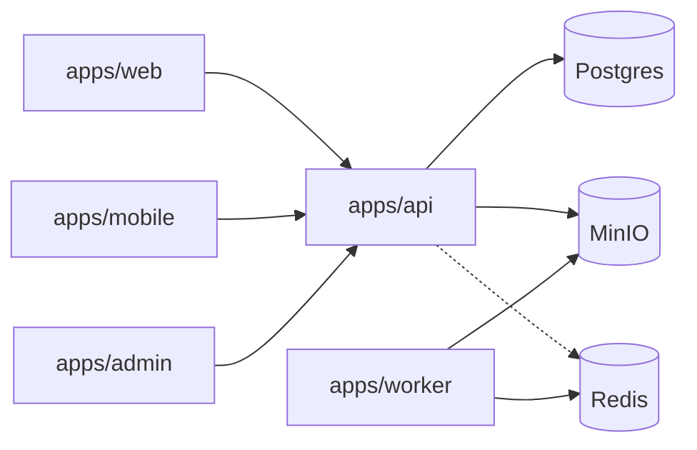

# Tessera

A photo and video social platform. Chronological by default, with a transparent Discover ranking, mosaic profiles, Circles, Moments that can be Kept, Loops with a wellbeing budget, Boards, a Memory Map, authenticity labels, and a unified Inbox.

Tessera is **not** an Instagram clone. It does not use Instagram’s name, logo, gradient, icons, copy, or layouts.

This repository is a **pnpm + Turborepo** monorepo. Build order is the phase list in [`tessera-build-prompt.md`](./tessera-build-prompt.md). **You are looking at Phase 9 — Safety & admin.** Creator tools are Phase 10.

## Architecture



More detail: [`docs/architecture.md`](./docs/architecture.md). Stack: [`docs/decisions/0001-stack.md`](./docs/decisions/0001-stack.md). Auth: [`docs/decisions/0002-auth.md`](./docs/decisions/0002-auth.md). Media: [`docs/decisions/0003-media.md`](./docs/decisions/0003-media.md). Loops: [`docs/decisions/0005-loops.md`](./docs/decisions/0005-loops.md). Discover: [`docs/ranking.md`](./docs/ranking.md), [`docs/decisions/0006-discovery.md`](./docs/decisions/0006-discovery.md). Inbox: [`docs/decisions/0007-messaging.md`](./docs/decisions/0007-messaging.md). Notifications: [`docs/decisions/0008-notifications.md`](./docs/decisions/0008-notifications.md). Circles and Boards: [`docs/decisions/0009-organisation.md`](./docs/decisions/0009-organisation.md). Safety: [`docs/decisions/0010-safety.md`](./docs/decisions/0010-safety.md).

## Apps and packages

| Path | Role in Phase 9 |
| --- | --- |
| `apps/web` | Feed through Boards, plus reports, restrict, sensitive blur, export/delete, wellbeing nudges |
| `apps/mobile` | Expo tabs plus Circles and Boards screens |
| `apps/api` | NestJS through organisation, plus `/v1` reports/restrict/export/delete and `/v1/admin/*` |
| `apps/worker` | BullMQ: media (with classifier stub), feed, Moments, Loops, notifications, scheduled posts, export, hard-delete |
| `apps/admin` | Separate staff app on :3002 — queue, lookup, takedown, suspend, appeals, audit |
| `packages/db` | Prisma 7.10 schema, migrations, client factory |
| `packages/media` | Filters, Sharp/FFmpeg processing, storage, fan-out, finish line, notification aggregation |
| `packages/tokens` | Palette, semantic tokens, contrast tests |
| `packages/ui` | Web primitives (Radix Slot, Tessera tiles) |
| `packages/types` | Nav, identity, posts, appreciations, inbox, notifications |
| `packages/validation` | Zod: handles, auth, posts, media, inbox, notification prefs |
| `packages/api-client` | Typed client |
| `packages/i18n` | English catalog |

## Requirements

- Node 22 (see `.nvmrc`)
- pnpm 9.15+
- Docker Desktop for Postgres (required), plus Redis/MinIO/Meilisearch/Mailpit
- **FFmpeg** only if you upload video. Images work without it. Missing FFmpeg fails the media row with `FFMPEG_MISSING` (labelled, not stubbed)

## Local setup

```bash
pnpm install
pnpm compose:up
cp .env.example .env
cp apps/api/.env.example apps/api/.env
pnpm db:deploy
pnpm seed
pnpm dev                 # web :3000, api :3001, admin :3002, worker
```

| URL | What |
| --- | --- |
| http://localhost:3000 | Web — Following feed |
| http://localhost:3000/discover | Ranked Discover + search |
| http://localhost:3000/discover/tune | Tune my Discover sliders |
| http://localhost:3000/create | Post, Moment, or Loop |
| http://localhost:3000/loops | Vertical Loops player |
| http://localhost:3000/inbox | Unified Inbox (messages + activity) |
| http://localhost:3000/settings/circles | Named audiences |
| http://localhost:3000/boards | Saved and custom Boards |
| http://localhost:3000/settings/notifications | Per-type channels, quiet hours, digest |
| http://localhost:3000/login | Sign in |
| http://localhost:3001/health | API liveness. Readiness is `/health/ready` |
| http://localhost:3001/docs | OpenAPI |
| http://localhost:3002 | Admin — staff login (not the public session) |
| http://localhost:9001 | MinIO console (`tessera` / `tessera-minio`) |
| http://localhost:8025 | Mailpit UI |
| `pnpm --filter @tessera/mobile start` | Expo |

Seeded login: `asha@tessera.test` / `Seedpass1!`  
Admin login: `admin@tessera.test` / `Adminpass1!`

Asha follows Ravi, Nia, Mara, and Kenji. Home has their posts, a **You're caught up** finish line, a **Moments** tray (Kenji is muted for Moments), and a **Loops** door. Inbox has a 1:1 with Ravi, a **Clay crew** group, a request from Omar, and activity (Ravi and Nia appreciated a post, Tess followed, Piotr asked to follow). Discover shows public posts from Omar, Piotr, Bea, Tess, and Yara — people she does not follow — with **Why am I seeing this?** Omar’s profile has a **Memory Map**. Asha follows `#clay` and `#climb`. If FFmpeg is installed, Kenji’s seed Loop is in the player. Tess has a 15-minute Loops budget. Mara’s profile has a **Studio light** Reel Shelf.

Asha has Circles **Family** (June) and **Climbing crew** (Ravi, Nia), a default **Saved** Board, a public **Granite** Board (Ravi can add), a synced draft, and a scheduled post. She restricts Piotr; Omar’s seed report on her public tile sits in the admin queue; that tile is marked sensitive. **Iris** is 16, private, follower-only DMs, and stays out of Discover/people search. Meilisearch is optional: without it, search uses Postgres (`engine: "postgres"`).

The media classifier in local/dev is a **labelled stub** (`CLASSIFIER_PROVIDER=stub`). It always returns `unknown` and does not pretend content is safe.

Google and Apple sign-in are implemented. Without `GOOGLE_*` / `APPLE_*` env vars the API returns **501 `OAUTH_NOT_CONFIGURED`**. Alt-text AI drafts are the same with `XAI_API_KEY` → **501 `ALT_SUGGEST_NOT_CONFIGURED`**. Expo / Web Push without `EXPO_ACCESS_TOKEN` / `PUSH_DRIVER=live` or VAPID keys is **labelled SOFT-FAIL** — devices still store, nothing is pretended as sent.

```bash
pnpm test                # unit + API tests (integration runs when DATABASE_URL is set)
pnpm e2e                 # Playwright: shell, login, feed, Moments, Loops, Discover, unified Inbox
pnpm seed                # 13 users + admin, safety cases, Circles, Boards
```

CI and Playwright use `STORAGE_DRIVER=fs` and `MEDIA_PROCESS=inline` so they do not need MinIO or Redis. Playwright waits on `/health/ready`, which stays available when Redis or Meilisearch is unset and returns 503 when Postgres or storage is down.

## Scripts

| Script | Action |
| --- | --- |
| `pnpm dev` | Turbo dev for web, api, worker, admin |
| `pnpm build` | Production builds |
| `pnpm lint` / `typecheck` / `test` | ESLint, TypeScript, and Vitest |
| `pnpm compose:up` / `compose:down` | Docker infra |
| `pnpm db:generate` / `pnpm db:migrate` / `pnpm db:deploy` | Prisma 7 client and migrations |
| `pnpm seed` | Identity through organisation, plus reports, restrict, admin, Iris (minor) |

`pnpm lint` runs ESLint 9 from the repo root in every workspace, type-aware, with `--max-warnings 0`. `apps/web`, `apps/admin`, and `packages/ui` also run `eslint-plugin-react-hooks` and `eslint-plugin-jsx-a11y`. `import/no-restricted-paths` rejects an import from `apps/*` inside `packages/*`. `apps/api` keeps the Nest async rules on, so a floating or misused promise fails lint.

The API and worker run with `tsx` (TypeScript source, including workspace packages). Prisma stays on **7.10**, not 8.

## Testing

- **Unit:** Vitest — filters, authenticity, finish line, ranking sliders, places, TOTP
- **API integration:** posts, Moments, Loops, Discover, Inbox, notifications, Circles, Boards, safety, admin
- **Web E2E:** Playwright — nav, seeded login, Following finish line, Moment tray, Loops door, Discover why-sheet, Inbox thread + Appreciations filter
- **Mobile E2E:** not in CI yet

## Observability

Pino logs from the API and worker. **Sentry and OpenTelemetry are disabled** unless `SENTRY_DSN` / `OTEL_EXPORTER_OTLP_ENDPOINT` are set, and even then they are not wired — labelled in `apps/api/src/observability.ts`.

## Deployment

Not in Phase 7. Production notes land in Phase 11.

## Phases

0. Foundations  
1. Identity & graph  
2. Posts & feed  
3. Moments  
4. Loops  
5. Discovery  
6. Messaging  
7. Notifications (this)  
8. Circles & Boards  
9. Safety & admin (this)  
10. Creator tools  
11. Hardening  
