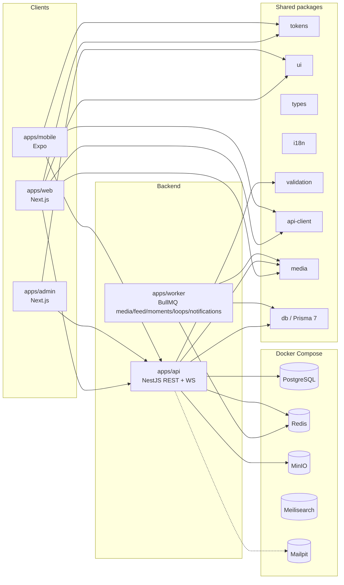

# Architecture

Tessera is a monorepo. Phase 9 adds reporting, restrict, a labelled classifier stub, a staff admin app, sensitive-content controls, remaining minor rules, export, and deletion.

## Runtime in Phase 7

| Process | Port | What it does |
| --- | --- | --- |
| Web | 3000 | Auth, Following feed + Moment tray, Loops player, Discover, create Post/Moment/Loop |
| API | 3001 | `/health`, identity, media, posts, feed, Moments, Loops, search, Discover, Inbox REST + `/v1/inbox` sockets, notifications, OpenAPI `/docs` |
| Admin | 3002 | Staff app. Separate `tessera_admin_*` cookies. Queue, lookup, takedown, suspend, appeals, audit |
| Worker | (no HTTP) | `tessera-media` (classifier stub before publish) + feed + Moments + Loops + notifications + scheduled + `tessera-safety` (export, hard-delete, hourly idempotency purge) |
| Expo | 8081 | Tabs + login/signup + feed/create/Me mosaic |
| Postgres | 5432 | Identity, graph, posts |
| Redis | 6379 | Shared rate limits, the auth session cache, and BullMQ. If Redis is down, rate limits fall back per process (non-authoritative), authenticated requests read sessions from Postgres, and jobs run inline. |
| MinIO | 9000 / 9001 | Originals and variants. Tests may use `STORAGE_DRIVER=fs` |
| Meilisearch | 7700 | People, hashtags, places, captions. Postgres fallback if down |
| Mailpit | 8025 / 1025 | Verification and reset emails |

## Rate limits

`RateLimitService` is the shared limiter. Redis runs one Lua script per hit (`INCR`, then `PEXPIRE` only when the key has no TTL) so a crash cannot leave a counter that never expires. A `429` includes `Retry-After` set to the seconds left in that window. When `REDIS_URL` is unset, or Redis is failing, the process uses its own counter and logs that this fallback is non-authoritative. Redis is tried again after 5 seconds, doubling up to 30 seconds, instead of being turned off for the life of the process.

## Auth session cache

Authenticated requests cache the session and suspension tuple in Redis under `auth:sid:{sessionId}` for at most 60 seconds, and never longer than the access token or that session's expiry. Logout, session revoke, refresh rotation, refresh-token reuse, password reset, suspension, and account deletion drop it. Bulk revokes also bump `auth:ugen:{userId}` after the database commit, so a session cached mid-revoke cannot keep the old tuple.

When `REDIS_URL` is unset or Redis is failing, the guard reads Postgres and logs that the cache is bypassed. Tuples written before the failure are ignored until that 60 second TTL has passed. Redis is tried again after 5 seconds, doubling up to 30 seconds. Inbox socket connects and admin sessions still read Postgres on each check.

## Signing keys

User access tokens (`iss: tessera`), admin access tokens (`iss: tessera-admin`), and short-lived purpose tokens (2FA challenge, OAuth state, OAuth setup) are HS256 and do not share a secret. The env vars are `JWT_ACCESS_SECRET`, `JWT_ADMIN_SECRET`, and `JWT_PURPOSE_SECRET`. Each must be at least 32 characters and distinct. `apps/api/src/main.ts` checks that before the process listens.

Each token carries `kid`, the first 16 hex characters of SHA-256 of the secret that signed it. To rotate, set `JWT_*_SECRET_PREVIOUS` to the outgoing secret and put the new value in `JWT_*_SECRET`. Verification follows `kid`. Tokens with no `kid` try the current secret, then the previous one. Access tokens last 15 minutes, so the previous secret can come out after that. Filesystem media signatures use the current `JWT_ACCESS_SECRET` only and do not accept the previous secret.

## Upload pipeline

Client requests a presigned URL (or `POST /v1/media/:id/bytes` on the fs driver) → uploads the original → `POST .../complete` → worker (or inline) strips EXIF, writes AVIF/WebP variants at 150/320/640/1080, blurhash → post becomes visible → fan-out job writes `FeedEntry` rows.

Reads of non-public media use expiring URLs. S3 uses presigned GETs. The fs driver (CI, Playwright, and any non-S3 deployment) returns `/v1/media/file/:key?exp=&sig=` instead of a bare path. The signature is HMAC-SHA256 of the expiry and the object key.

Video uses FFmpeg HLS. If FFmpeg is missing the media row is `failed` with `FFMPEG_MISSING`.

## Following feed

Strict reverse-chronological from accepted follows plus the viewer's own posts. Mutes (`posts`/`both`) and blocks are applied at write and read. After posts newer than `FeedState.followingCaughtUpAt`, the API returns a finish line. Older posts require `keepGoing=true`.

Pages use an opaque `cursor` (`publishedAt` descending, then post `id` descending). Each request reads `limit + 1` rows from three branches and merges them: fan-out `FeedEntry` rows, Circle posts shared with the viewer, and posts from accounts at or above `FEED_FANOUT_FOLLOWER_THRESHOLD` (those accounts are merged at read time, not written into `FeedEntry`). `nextCursor` is null on the last page. `finishLine.seenSinceLastVisit` counts every post newer than the finish line, not just the current page.

Discover ranking is rules-based. See `docs/ranking.md`. Candidate pool is public posts outside the graph. Impressions store the actual signals.

## Inbox

Threads are 1:1 or groups (max 32). REST under `/v1/inbox`. Real-time events on the `/v1/inbox` Socket.IO namespace, authenticated with the access cookie or bearer token. Redis pub/sub adapter when Redis is up; in-process otherwise (labelled). Presence is a Redis key with TTL; in-memory if Redis is down.

v1 stores plaintext (`e2eVersion = 0`). `ciphertext` and `bodyEncoding` are reserved so E2E can land later without a rewrite. See `docs/decisions/0007-messaging.md`.

Message requests: non-followers of the recipient wait in Requests when the recipient allows “anyone”. Minors only accept followers. Thread and message reports open a moderation case.

## Notifications

Activity lives in the same Inbox tab as threads. Filters: All / Messages / Mentions / Appreciations / Follows / Requests.

Rows aggregate on `(recipientId, aggregateKey)` — “Asha and 12 others appreciated your post”. New actors reopen an unread tile.

Channels: in-app (always stored when enabled), Expo push, Web Push (VAPID), email. Quiet hours skip push and email except security alerts. A daily digest holds non-security email until ~09:00 local time.

Push without `EXPO_ACCESS_TOKEN` / `PUSH_DRIVER=live` or VAPID keys is **labelled SOFT-FAIL** — tokens are stored, nothing is faked as delivered.

Board invites emit `board_invite`. The `tessera-scheduled` queue publishes due posts and emits `scheduled_post_published`.

## Search and places

Hashtag pages (top / recent) and hashtag follows. Place pages with a Tessera map. Memory Map on profiles (`memoryMapEnabled`). Public Boards are searchable.

## Moments

A Moment is one or more photo/video segments (video ≤ 30s) with stickers. It publishes when media is ready and `expiresAt` is `publishedAt + 24h`. The Home tray is read-time: own tile first, unseen before seen, then recency plus recent Appreciation/comment/view boosts. Mute `moments`/`both` hides rings. Keep copies a live Moment onto a Reel Shelf; the expiry job then **keeps**, **archives**, or **deletes**.

## Loops

A Loop is a `Post` with `kind=loop` plus a `Loop` row. Clips (up to 90s after trim and speed) are composed to HLS. Original audio is extracted as AAC when the creator allows reuse; there is **no licensed music** in v1. Captions run as a speech-to-text job and skip with `CAPTIONS_NOT_CONFIGURED` when none is wired. The vertical player preloads the next two videos and pauses when the optional daily budget is spent.
