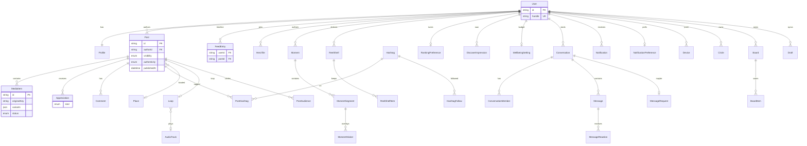

# Data model

Prisma 7 schema lives in `packages/db/prisma/schema.prisma`. Migrations are committed under `packages/db/prisma/migrations/`.

**Phase 1 tables:** `User`, `Profile`, `Session`, `OauthAccount`, `TotpSecret`, `RecoveryCode`, `EmailToken`, `Follow`, `Block`, `Mute`.

**Phase 2 tables:** `Post`, `MediaItem`, `Hashtag`, `PostHashtag`, `PeopleTag`, `HeroTile`, `Appreciation`, `Comment`, `CommentLike`, `CommentFilter`, `FeedEntry`, `FeedState`, `IdempotencyRecord`.

`IdempotencyRecord` is unique on `(userId, key, route)`. A finished row lives for 24 hours. Status `0` is an in-progress lock and is deleted after 2 minutes if the request never stores a response. The hourly `purge-idempotency` job on `tessera-safety` does both. No extra expiry column.

**Phase 3 tables:** `Moment`, `MomentSegment`, `MomentSticker`, `MomentStickerResponse`, `MomentView`, `MomentReaction`, `ReelShelf`, `ReelShelfItem`. `MediaPurpose` gains `moment`. Profiles gain `momentArchiveEnabled`.

**Phase 4 tables:** `Loop`, `AudioTrack`, `WellbeingSetting`, `WatchTimeLog`. `MediaPurpose` gains `loop`. `Post.kind=loop` is the public Loop.

**Phase 5 tables:** `Place`, `HashtagFollow`, `RankingPreference`, `RecentSearch`, `DiscoverImpression`, `SuggestedPersonDismiss`. `Post.placeId` is optional.

**Phase 6 tables:** `Conversation`, `ConversationPair`, `ConversationMember`, `Message`, `MessageAttachment`, `MessageReaction`, `MessageRequest`. `Profile` gains `activityStatusEnabled`, `readReceiptsEnabled`, `whoCanMessage`. `MediaKind` gains `audio`. `MediaPurpose` gains `message`.

**Phase 7 tables:** `Notification`, `NotificationPreference`, `Device`.

**Phase 8 tables:** `Circle`, `CircleMember`, `PostAudience`, `MomentAudience`, `Board`, `BoardCollaborator`, `BoardItem`, `BoardFollow`, `Draft`. `Post.scheduledAt`. `PostVisibility` / `MomentVisibility` gain `circles`.

**Phase 9 tables:** `Restrict`, `Report`, `ModerationCase`, `ModerationAction`, `Appeal`, `AdminUser`, `AdminSession`, `AuditLog`, `KeywordFilter`, `MediaClassification`, `ExportJob`, `DeletionRequest`, `AppTimeLog`. `User.suspendedAt`. `Profile.sensitivityLevel`. `Comment.hiddenByRestrict`. `Post`/`Moment` `sensitive` + `takenDownAt`.

## Graph rules

- Follow on a public account is `accepted` immediately.
- Follow on a private account is `pending` until the followee accepts or declines.
- Block is mutual invisibility (404 on profile) and deletes both follow directions plus mutes and feed rows.
- Mute does not unfollow; `posts` / `both` hide posts from Following. Phase 1 seed mutes Kenji for Moments only, so his posts still appear.
- Handle changes have a 14-day cooldown (`HANDLE_CHANGE_COOLDOWN_DAYS`).

## Posts

- Visibility: `public`, `followers`, or `circles` (via `PostAudience`). Membership is private to the Circle owner.
- `scheduledAt` holds unpublished posts until the `tessera-scheduled` job.
- Authenticity is required. `unfiltered` is rejected if any filter or adjustment is applied.
- EXIF (including GPS) is stripped during processing. Place names are typed by the author.
- Hybrid fan-out: authors under 10,000 followers write `FeedEntry` rows; larger accounts merge at read time.

## Moments

- Visibility: `public`, `followers`, or `circles`. The tray includes Circle-shared Moments even without a follow.
- Stickers: text, drawing, mention, location, hashtag, poll, question, countdown, link (Creator/Business only).
- Reactions are one of six Tessera emojis, unique per viewer+segment.
- Expiry job: Keep (shelf item exists) → leave rows; archive setting on → leave rows for the author; else delete Moment and unreferenced media.
- Reel Shelves are themed, followable-looking tiles on the mosaic profile. They are not a hidden story archive.

## Loops

- Vertical video, 90 seconds after trim and speed. Multi-clip recipes live on `Loop.clips`.
- `AudioTrack` is original sound only. `allowReuse` is the creator’s opt-in. No music catalogue.
- Captions: `CaptionStatus` pending/ready/skipped/failed. Skipped means the STT provider is not configured.
- `WellbeingSetting.loopsBudgetMinutes` null = off. Bonus minutes and same-day dismiss live on that row; watch seconds in `WatchTimeLog`.

## Discovery

- Places are author-typed. Coordinates are stored on `Place` when known. EXIF GPS is never used.
- `RankingPreference` sliders are 0–1 and change `scoreCandidate()`.
- `DiscoverImpression.signals` is the list shown in “Why am I seeing this?”.
- Public Boards are searchable. Circle posts stay out of Discover.

## Messaging

- 1:1 uniqueness via `ConversationPair` (`userLowId`, `userHighId`).
- `Message.bodyEncoding` is `plaintext` in v1. `ciphertext` is null. `e2eVersion` is 0. E2E later writes ciphertext into the same row.
- Unsend is a soft delete (`deletedAt`); the body is cleared.
- Requests are 1:1. Groups do not use the request table.
- Read receipts honour `Profile.readReceiptsEnabled`. Delivery always records `lastDeliveredMessageId`.

## Notifications

- Unique `(recipientId, aggregateKey)`. Follow requests stay one row per actor. Appreciations, comments, tags, Moment reactions, and new followers collapse.
- `actorIds` stores up to three recent actor ids; `actorCount` is the full total.
- `Device.platform` is `expo` or `web_push`. Web Push keys live in `keys`.
- Security alerts always email. Quiet hours skip other push and email.
- `board_invite` fires on Board collaborator invite. `scheduled_post_published` fires when the worker publishes a due post.

## Circles and Boards

- Circle `(ownerId, name)` is unique. Members do not see Circles they belong to.
- One default `Saved` Board per owner (`isDefault`, partial unique index).
- Board visibility: `private`, `shared`, `public`. Invites sit on `BoardCollaborator.acceptedAt`.
- Drafts store the create payload as JSON and sync across devices.
